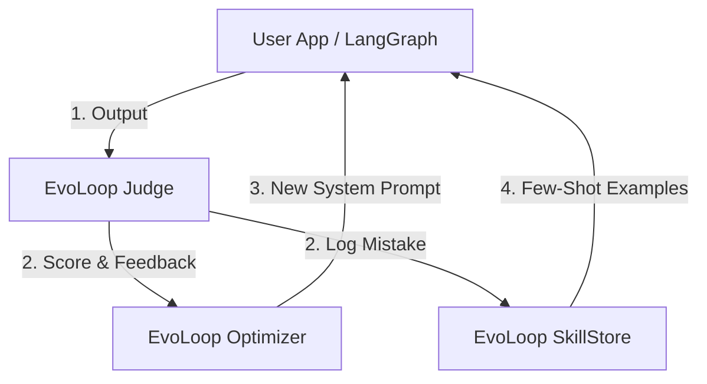

# Architecture

EvoLoop is designed as a set of standalone modules that can be integrated into any existing agent loop. It does not enforce a specific control flow.

## High-Level Modules

### 1. `evoloop.evals` (The Judge)
This module is responsible for assessing the quality of an agent's output.

*   **Input**: `User Query`, `Agent Response`, `Context` (optional).
*   **Output**: `Score` (0-1 or 0-10), `Feedback` (Text explanation), `Metadata`.
*   **Components**:
    *   `Judge`: The main class. Can be configured with different "Personas" (e.g., Code Reviewer, Fact Checker).
    *   `Metric`: Pre-defined criteria (Correctness, Safety, Conciseness).

### 2. `evoloop.optimization` (The Optimizer)
This module implements the "Self-Evolving" logic. It takes feedback and transforms the agent's configuration (Prompts).

*   **Input**: `Current System Prompt`, `FeedbackHistory`, `Failed Examples`.
*   **Output**: `Optimized System Prompt`.
*   **Strategies**:
    *   **DSPy-style Optimization**: Rewriting instructions to address specific failure modes.
    *   **Reflexion**: Generating immediate critique for retry loops.

### 3. `evoloop.dataset` (The Memory)
This module manages the "Experience" of the agent for Dynamic Few-Shotting.

*   **Storage**: A lightweight vector store (or interface to external ones) to save `{Query, Mistake, Correction}`.
*   **Retrieval**: Semantic search to find relevant past experiences when a new query arrives.
*   **Usage**: The user calls `store.get_context(query)` and appends the result to their prompt.

## Data Flow Example

